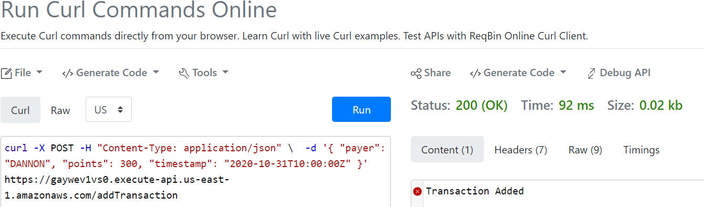
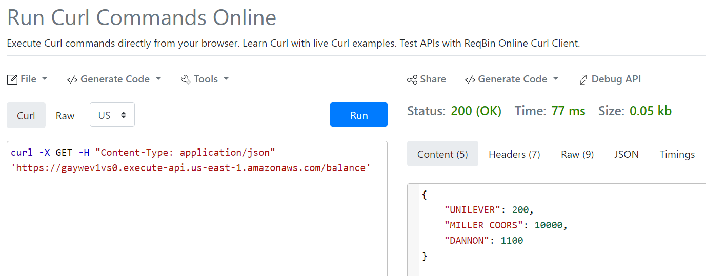
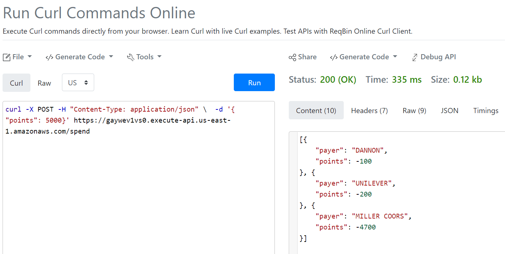
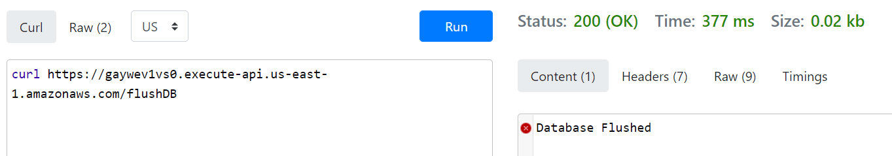

# BackedendEngineerInterview

The goal of creating this repository is to document the functions that handle requests sent to the API located at : https://gaywev1vs0.execute-api.us-east-1.amazonaws.com

A company sent me this task to evaluate my skills for backend engineer position and this repository exists because of that.

This repository includes 3 lambda function handlers written in Python hosted on AWS.

The API is managed by AWS API Gateway. The database is nosql, DynamoDB(poor choice which was later realized). 

> Note: The API is currently populated with the test data.

## pythonRun

The repository includes a directory called 'pythonRun'. 
The directory contains .py files to call the endpoints directly on the samples from the handout.

## Endpoints:-

1. /addTransaction

The URL for the endpoint is: https://gaywev1vs0.execute-api.us-east-1.amazonaws.com/addTransaction
A person can make HTTP POST requests to the URL. The request adds transactions passed to the database.

Transaction Format: { "payer": string, "points": int, "timestamp": string }

CURL example for adding transactions:-

curl -X POST -H "Content-Type: application/json" \  -d '{ "payer": "DANNON", "points": 300, "timestamp": "2020-10-31T10:00:00Z" }' https://gaywev1vs0.execute-api.us-east-1.amazonaws.com/addTransaction

2. /balance

The URL for the endpoint is: https://gaywev1vs0.execute-api.us-east-1.amazonaws.com/balance
A person can make HTTP GET requests to the URL. The request returns the current respective totals for each payer in the response body.

You can visit the URL in a browser to see the balances:- https://gaywev1vs0.execute-api.us-east-1.amazonaws.com/balance

CURL example for adding transactions:-

curl -X GET -H "Content-Type: application/json" 'https://gaywev1vs0.execute-api.us-east-1.amazonaws.com/balance'

3. /spend

The URL for the endpoint is: https://gaywev1vs0.execute-api.us-east-1.amazonaws.com/spend
A person can make HTTP POST requests to the URL. The request returns a dictionary showing the distribution of points passed.

CURL example for spending points:-

curl -X POST -H "Content-Type: application/json" \  -d '{ "points": 5000}' https://gaywev1vs0.execute-api.us-east-1.amazonaws.com/spend

4. /flushDB

The endpoint cleans the database of all entries. I had to create the extra endpoint in order to test various cases.
The URL for the endpoint is: https://gaywev1vs0.execute-api.us-east-1.amazonaws.com/flushDB
A person can make ANY HTTP request to the URL or open it in a browser to clean the database.

> Further Improvement: Change the database to structured database such as s3 or Aurora. The handlers need to be updated accordingly. Redundant entries should be removed. Better Timestamp management. Multiple tables to handle deleted transactions. Better handling of edge cases such as more spending points than transactions. Securing the endpoints.
